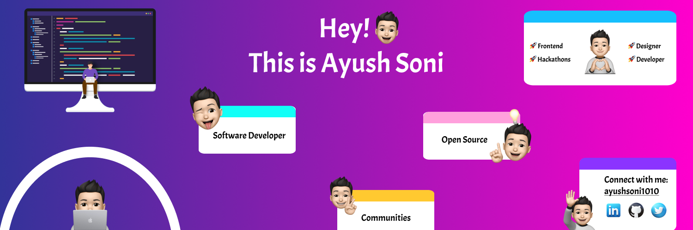

<h2 align="left">Hey, I'm Ayush Soni </h2>
<p>👨‍🎓This is Ayush Soni, a junior-year computer science undergraduate, pursuing Bachelor of Technology from <a href="https://www.medicaps.ac.in/">Medi-Caps University</a>, Madhya Pradesh. I am always fascinated by programming and passionate about exploring the latest technology and developing new cool things.</p>
<p>⚡I am a Full Stack Developer, an Open-Source Enthusiast, and a UX/UI Designer who loves to work with frontend and design things creatively and curiously. I have participated as a participant, and mentor in many open-source contribution programs and hackathons. I am always up for collaborating within the communities and contributing to open-source projects.</p>

<h2 align="left">Connect with me🤝</h2>
<div align="left">
  <a href="https://linkedin.com/in/ayushsoni1010/" target="_blank"></a>
  <a href="https://twitter.com/ayushsoni1010" target="_blank"></a>
  <a href="https://ayushsoni1010.com" target="_blank"></a>
  <a href="https://youtube.com/@ayushsoni1010" target="_blank"></a>
  <a href="https://linktr.ee/ayushsoni1010" target="_blank"></a>
  <a href="https://instagram.com/aayushsoni1010" target="_blank"></a>
  <a href="mailto:ayushsoni1010.work@gmail.com" target="_blank"></a>
  <a href="https://leetcode.com/ayushsoni1010/" target="_blank"></a>
</div>

<h2 align="left">About me👨‍💻</h2>

```JavaScript
const ayushsoni1010 = {
  fulName: "Ayush Soni",
  pronouns: "He/His/Him",
  tags: [ "Frontend❤️" , "Open-Source🚀" , "Hackathons⚡" , "Cloud🌩️" , "Backend💡" , "Mentoring🙌" , "Communities🎯"],
  communities: ["Microsoft Learn Student Ambassador👨‍🎓", "HEKORS Community💜"],
  askMeAbout: [ "Web Development", "Cloud Technology" , "Open Source" , "API's" ],
  reachMeOut: ["ayushsoni1010.work@gmail.com"],
  toFindMeUsername: "@ayushsoni1010"
}
```

<h2 align="left">Recent Blogs✍️</h2>
<div align="left">
  <a href="https://hashnode.com/@ayushsoni1010" target="_blank"></a>
  <a href="https://dev.to/ayushsoni1010" target="_blank"></a>
  <a href="https://medium.com/@ayushsoni1010" target="_blank"></a>
  <a href="https://ayushsoni1010.com/blogs" target="_blank"></a>
  <a href="https://www.notion.so/ayushsoni1010/Ayush-Soni-9c6e41ece1994828b3a342318e687447" target="_blank"></a>
  <a href="https://ayushsoni1010.blogspot.com/" target="_blank"></a>
</div>

<h2 align="left">Experience⚡</h2>
<p>● <a href="https://www.economize.cloud/">Economize.cloud (@economize.cloud)</a> - Worked on a dashboard application that is based on cloud technology and SaaS product. Implemented and fixed the frontend UI of the application, storybook setup of base wrapper components and build charts using chart.js and vue-chart.js in a wrapper component. Contributed to backend of the application, worked on the landing and blog website.</p>
<p>● <a href="https://getsocialnow.co/">Script Fellowship</a> -  Worked on KaroVerify, CraftBrain, and HACK-OV8 projects which are based on the MERN stack. Got selected as a Fellow in Script Fellowship Program'21 at Script Foundation. I am the top first contributor in Script Fellowship. Helped other fellows to know more about open-source development.</p>
<p>● <a href="/">Open Source Contributor/Mentor</a> -  I have participated as a participant and mentor in many open-source contribution programs such as <a href="https://letsgrowmore.in/soc/">LGMSoC</a>, <a href="https://www.devincept.com/">DCP</a> , <a href="https://gwoc.girlscript.tech/">GWoC</a> , <a href="https://swoc.scriptindia.org/">SWoC</a> , <a href="https://gdsc-woc.tech/">WoC-2.0</a>. Contributed to open-source projects related to frontend and UI-UX and assisted in the development of documentation of projects. </p>


<h2 align="left">Skills🚀</h2>
<p>Languages :</p>
<div>
 
 	
 
 	
 
 	
</div>

<p>Libraries and Frameworks :
<div>
 
 
 
 	
 
 
 
 
 
 
 
 
 
 
 
	
	
</div>

<p>Databases :
<div>
 
 
</div>

<p>Tools and Technologies :</p>
<div>
 
 	
 
 
 
 	
 
 
 
 	
</div>
</p>

<p>☁️ Hosting/SaaS :</p>
<div>
 
 	
 
 
 
 
</div>
</p>

<h2>Volunteering and Community work📣</h2>
<div>
	<p>● <a href="https://studentambassadors.microsoft.com/#">Microsoft Learn Student Ambassador</a> - Microsoft Learn Student Ambassadors are the on-campus leaders with a passion for making a difference, building vibrant communities, and sharing the latest tech with their peers. Attended various events organized under the MLSA community.
	Interacting with fellow MLSA's in the community and seeking for the sessions to conduct. In a collaboration with the Coding Society Community, I had conducted a 3-days long session on Web Development and build a hands-on project which is based on LinkTree.
Conducted a session on Git and GitHub with a hands-on activity and engage folks to build a project to start contributing to open source, taught best practices about it, and Hacktoberfest kickoff within the HEKORS Community
</p>
	<p>● <a href="/">Hackathons Participant/Mentor</a> - I have participanted in many hackathons as a participant and mentor in <a href="https://mlh.io/">Major League Hacking</a> , <a href="https://hackthenorth.com/">HackTheNorth</a> , <a href="https://hackacode.anyonecanco.de/">AnyoneCo.de</a>. In team collaboration, we have participated in MLH's AbracadabraHacks and made a Hogwatrz Magical world website using Vanilla JS, HTML, CSS/SCSS. Participated in the MLH's Local Hack Day: Learn hackathon, completed challenges, learned new things, and joined the guilds. Mentored hackers at hackathon and collaborated with the organizers and volunteers.
</p>	
	<p>● <a href="http://thedesignsystems.com/">The DesignSystems (@DesignSystemsOSS)</a> - Working on a CSS library that results in solving frontend crisis called eccentrictouch using ReactJS, SCSS and Working on thedesignsystems community website and UI components from scratch.</p>
	<p>● <a href="/https://gdsc.community.dev/medi-caps-university-indore/">GDSC Medi-Caps</a> - Assisted in mentoring students about web development and open-source. Mentoring people in the form of taking sessions about Web Development and Open-Source</p>
	<p>● <a href="/">Volunteer and CA</a> - In <a href="https://hackthenorth.com/">HackTheNorth</a>, I had Assisted in the development of team management with the hackers, volunteers, judges, and organizers. Holding up meet-ups and internal meetings with the lead organizers and volunteers. At <a href="https://letsgrowmore.in/soc/">LetsGrowMore</a> I had collborated within the community and mentored people about open source and opportunities.</p>
</div>
	


<div>
<h2>Stats📈</h2>	

<p align="center">
  
  
</p>
</div>

